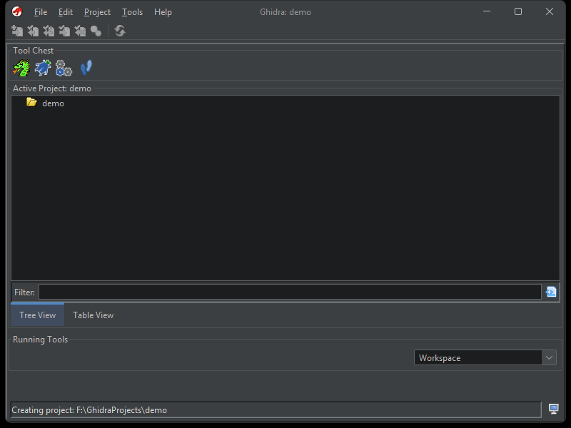
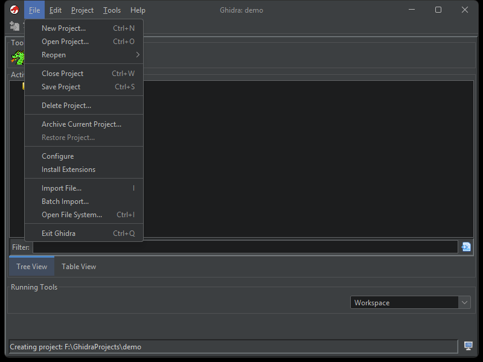
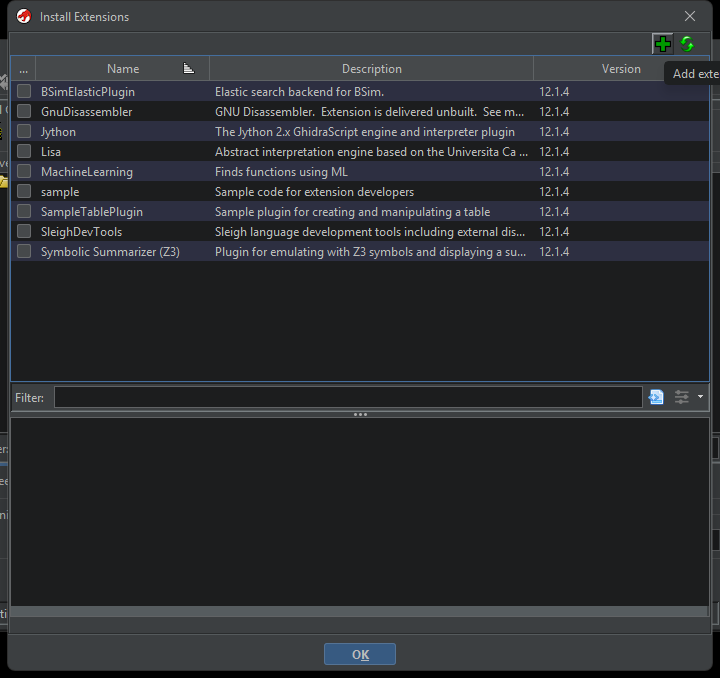
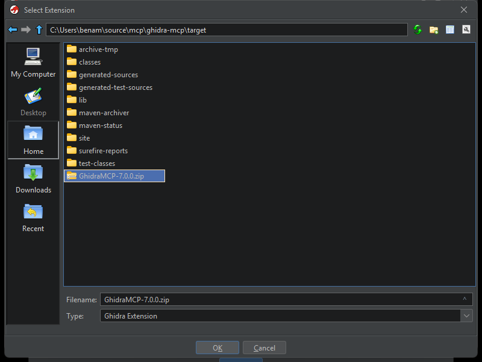
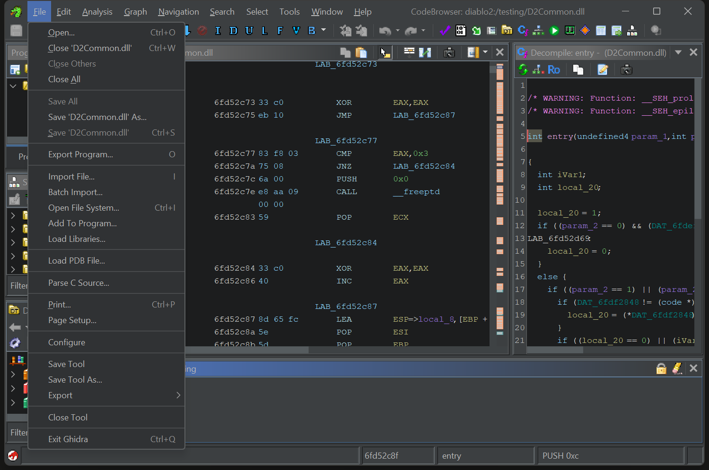
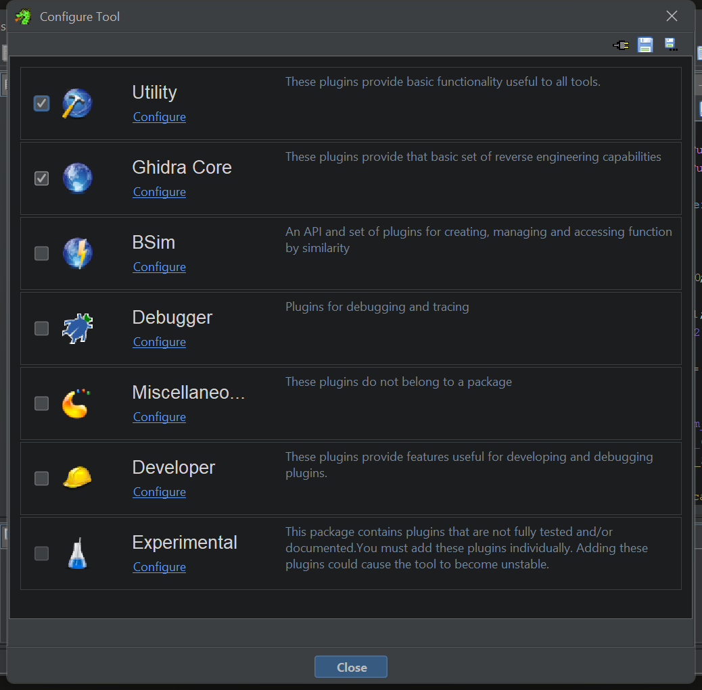
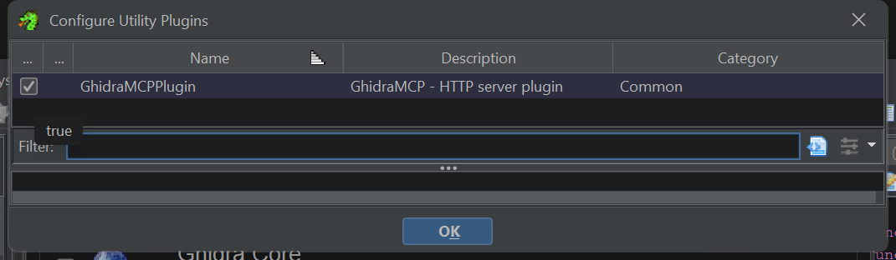
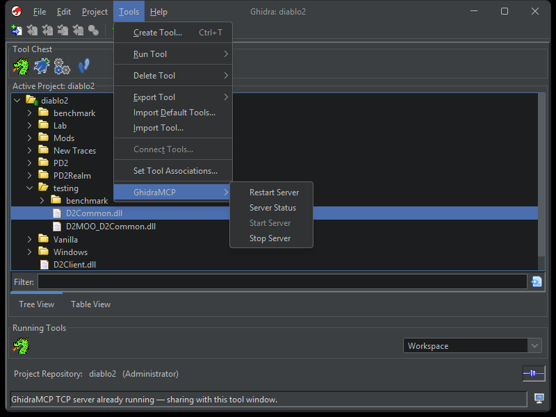
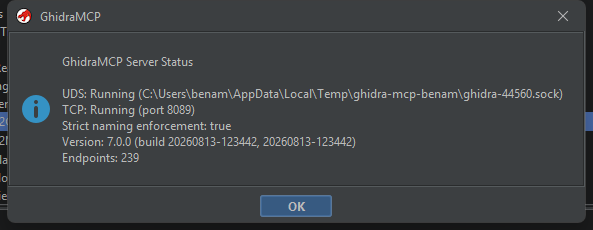

# Installing the extension by hand (Ghidra GUI)

`python -m tools.setup deploy` does everything on this page for you: it copies
the extension into your Ghidra user profile, patches the tool configuration and
restarts Ghidra. Use this page when you would rather click through Ghidra's own
dialogs, when you are installing a release zip on a machine without the repo,
or when you need to see what the automated deploy just did.

Everything here is Ghidra's standard extension flow. The screenshots were taken
on Windows with the dark theme; the dialogs are the same on Linux and macOS.

## What you need

One zip file, `GhidraMCP-<version>.zip`, built for the exact Ghidra version you
run. Ghidra refuses an extension whose stamped version does not match its own,
so a zip built for 12.1.3 does not load in 12.1.4. Get it from one of:

| Source | Path |
| --- | --- |
| GitHub release asset | `GhidraMCP-<version>.zip` on the [Releases](https://github.com/bethington/ghidra-mcp/releases) page |
| Gradle build (`./gradlew buildExtension`) | `build/distributions/GhidraMCP-<version>.zip` |
| Maven build (`python -m tools.setup build`) | `target/GhidraMCP-<version>.zip` |

The Gradle build stamps the Ghidra version from the installation you pass in
`-PGHIDRA_INSTALL_DIR`; the Maven build stamps it from `pom.xml`. Either way,
check the stamp before installing if you have more than one Ghidra around:

```bash
unzip -p GhidraMCP-7.0.0.zip GhidraMCP/extension.properties | grep ^version
```

A stock Ghidra installation looks like this. You do not put anything in here;
the extension goes into your user profile, not the installation.

```text
ghidra_12.1.4_PUBLIC/
├── Extensions/          # Ghidra's own optional extensions (Jython, BSim, ...)
├── Ghidra/              # the application
├── GPL/
├── docs/
├── licenses/
├── server/              # Ghidra Server scripts
├── support/             # analyzeHeadless, launch scripts
├── ghidraRun            # Linux / macOS launcher
├── ghidraRun.bat        # Windows launcher
└── LICENSE
```

## 1. Open the project window

Launch Ghidra and open or create a project. Extensions are installed from the
project window, not from CodeBrowser.



## 2. File > Install Extensions



## 3. Add the extension zip

The dialog lists the extensions Ghidra ships with. GhidraMCP is not there yet.
Click the green **+** (Add extension) in the top right.



Pick `GhidraMCP-<version>.zip` and press **OK**. The screenshot shows a Maven
build under `target/`; a Gradle build is under `build/distributions/`.



GhidraMCP now appears in the list with its checkbox ticked. Press **OK**. Ghidra
tells you the change takes effect after a restart. Restart it.

Ghidra unpacks the zip into your user profile:

| OS | Location |
| --- | --- |
| Windows | `%APPDATA%\ghidra\ghidra_<version>_PUBLIC\Extensions\GhidraMCP\` |
| Linux | `~/.config/ghidra/ghidra_<version>_PUBLIC/Extensions/GhidraMCP/` |
| macOS | `~/Library/ghidra/ghidra_<version>_PUBLIC/Extensions/GhidraMCP/` |

## 4. Enable the plugin in CodeBrowser

After the restart, open a program in **CodeBrowser**. On the first launch after
installing an extension Ghidra usually asks whether to configure the new
plugins; answering yes lands you in the same dialog as below. If it did not
ask, or you said no, open **File > Configure**.



GhidraMCP is a **Utility** plugin. Click **Configure** under Utility.



Tick **GhidraMCPPlugin** and press **OK**, then **Close**.



Save the tool when Ghidra asks on exit, or the plugin is off again next time.

## 5. Check the server

The HTTP server starts as soon as the plugin loads; there is nothing to start
by hand. The project window's **Tools > GhidraMCP** menu shows the state and
lets you restart or stop it. **Start Server** is greyed out while the server is
already running.



**Server Status** shows both transports, the port, the plugin version and the
endpoint count.



The same check from a shell:

```bash
curl http://127.0.0.1:8089/check_connection
```

To change the port or turn a transport off: **Edit > Tool Options > GhidraMCP
HTTP Server** in CodeBrowser, then **Tools > GhidraMCP > Restart Server**.

## Next

Point your MCP client at the bridge. The root [README](../README.md#basic-usage)
covers the client configuration for stdio and HTTP transports, and
[connection-triage-guide.md](connection-triage-guide.md) covers what to do when
the client sees no tools.

## If something is off

- **GhidraMCP is missing from Install Extensions after adding it.** The zip was
  built for a different Ghidra version. Check the stamp with the `unzip`
  command above and rebuild or download the matching asset.
- **No Tools > GhidraMCP menu.** The plugin is installed but not enabled in this
  tool. Repeat step 4, and save the tool.
- **Server Status says TCP is not running.** Another process holds port 8089.
  The plugin falls back to the next free port in its range; the status dialog
  shows the one it bound. `netstat -ano | findstr :8089` on Windows or
  `lsof -i :8089` elsewhere names the other process.
