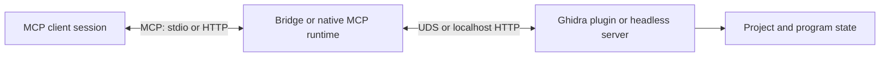

# Ghidra MCP Connection Triage Guide

When an MCP client reports missing tools, an empty instance list, `ghidra_offline`,
`Transport closed`, or a connection timeout, diagnose the layers in order before
restarting anything. A healthy Ghidra process does not prove that the plugin,
bridge, and client session are all healthy.

This guide is intentionally transport- and client-neutral. The same checks apply
to the Python bridge and to a future native MCP runtime, although the bridge has
additional discovery tools and transport fallbacks.

## The three layers



| Layer | What a healthy check proves | What it does not prove |
| --- | --- | --- |
| Ghidra server/plugin | The Ghidra-side HTTP or UDS service responds and can report instance state. | That the bridge is connected or that the client has a current tool list. |
| Bridge/native MCP runtime | MCP initialization works and the runtime can discover or register the Ghidra tools. | That the client is still using the current session or schema. |
| MCP client session | The client can initialize, call `tools/list`, and send a tool request. | That the underlying Ghidra instance is reachable if the client is showing cached state. |

The accessibility response from the Ghidra-side service is the source of truth.
An OS process, a listening port, or a socket file is only supporting evidence.

## 1. Probe the Ghidra side first

Use the configured Ghidra HTTP base URL. The examples use the default local URL;
replace it when the plugin or headless server is configured for another loopback
port or an authenticated endpoint.

```powershell
$ghidraUrl = "http://127.0.0.1:8089"

curl.exe -i "$ghidraUrl/mcp/health"
curl.exe -i "$ghidraUrl/mcp/instance_info"
curl.exe -i "$ghidraUrl/check_connection"
```

The repository also provides a bounded retry probe:

```powershell
python tools/ghidra_server_health_check.py `
  --url "$ghidraUrl/check_connection" `
  --timeout 5 `
  --retries 3 `
  --retry-delay 2
```

Interpret the results as follows:

- `200` from `/mcp/health` means the HTTP server can answer a health request.
- `200` from `/mcp/instance_info` means the server can report instance metadata such as
  its process, project, and open-program state.
- A successful `/check_connection` response proves the basic plugin/headless connection
  path, but it is not a replacement for instance metadata when more than one instance
  may be running.
- `Connection refused`, a timeout, or a non-Ghidra response means the Ghidra-side
  listener, configured URL, plugin/server lifecycle, or authentication path needs
  attention. Do not diagnose this as a client tool-cache problem yet.

If authentication is enabled, send the configured bearer token without printing it
into a transcript:

```powershell
curl.exe -H "Authorization: Bearer $env:GHIDRA_MCP_AUTH_TOKEN" `
  -i "$ghidraUrl/mcp/instance_info"
```

The health response can also show active requests, queue pressure, uptime, and memory.
If health is reachable but a single analysis call is slow, treat that as endpoint or
workload diagnosis rather than immediately treating it as a transport failure.

## 2. Check discovery and the bridge transport

In a Python-bridge deployment, `list_instances()` is the first read-only bridge probe.
It combines local socket discovery with the active TCP fallback and reports the
project, process ID, open programs, socket path, or URL when the server provides them.
Use `connect_instance()` only after selecting the intended instance.

The bridge's discovery order is deliberately conservative:

1. Discover local UDS socket files and query `/mcp/instance_info` when the Python
   runtime can dial UDS.
2. On Windows runtimes that cannot dial UDS, use the PID in the socket filename to
   match the socket with `/mcp/instance_info` responses obtained through loopback TCP.
3. When UDS discovery is unavailable or does not identify the target, probe the
   configured loopback TCP range and match the returned project metadata.
4. If `GHIDRA_MCP_URL` is explicitly configured, use that URL as the TCP target and
   still verify its instance metadata after connecting.

This is the projectless UDS/TCP case: a socket file or an open port may prove that
something is alive while still providing no trustworthy project identity. Do not
select the first port merely because it answers. If discovered instances have known
project names and none matches the requested project, the bridge refuses an arbitrary
TCP fallback to avoid connecting to the wrong project. Prefer an exact project match
or a known explicit URL, then verify `/mcp/instance_info`.

Useful read-only listener evidence is limited to reachability:

```powershell
Test-NetConnection 127.0.0.1 -Port 8089
Get-NetTCPConnection -State Listen |
  Where-Object { $_.LocalAddress -in @("127.0.0.1", "::1", "0.0.0.0", "::") }
```

These commands do not identify a Ghidra instance by themselves. An open port with
no valid `/mcp/instance_info` response is not a successful discovery result.

### Common discovery interpretations

| Observation | Likely boundary | Next read-only check |
| --- | --- | --- |
| Direct Ghidra health works, but `list_instances()` is empty | Discovery path, UDS capability, socket location, or TCP scan range | Query `/mcp/instance_info` directly and inspect bridge discovery logs. |
| A socket is present, but project/program metadata is missing | UDS cannot be queried or the instance-info request failed | Confirm the matching PID and query the loopback TCP URL. |
| Several instances are found and the requested project is absent | Safe project-selection guard | Use the exact project name or an explicit, verified URL. |
| Direct health and instance metadata work, but schema fetch fails | Bridge-to-Ghidra transport, auth, or schema endpoint mismatch | Request `/mcp/schema` through the same selected transport. |

## 3. Check schema registration and the client session

After a successful bridge connection, the bridge fetches `/mcp/schema` and registers
the analysis tools dynamically. Before that point, only management tools such as
`list_instances`, `connect_instance`, and tool-group helpers may be visible.

Use the following distinctions:

- If the client can call `list_instances()` but cannot see analysis tools, the bridge
  may not be connected to an instance, or its dynamic registry may not have been
  refreshed.
- If the bridge reports a successful connection and a nonzero registered-tool count,
  but the client still shows only the initial tools, the client session is likely
  caching an old `tools/list` result.
- If a lazy bridge startup is in use, call `load_tool_group()` for the needed category
  and then request `tools/list` again. Clients that do not honor `tools/list_changed`
  must explicitly re-list or reconnect.
- If the client reports `Transport closed` while the Ghidra health and instance
  endpoints remain healthy, repair the MCP session or bridge process first. Do not
  restart Ghidra just because the client transport closed.

For a stdio transport, the MCP client owns the bridge process. Inspect the client's
MCP server log for process exit, startup timeout, stderr, or initialization errors.
For streamable HTTP, confirm that the configured listener accepts connections and
reinitialize the MCP session at `/mcp`; a raw HTTP reachability check is not a full
MCP initialization test.

## Decision table

| Evidence | Diagnosis | Least-disruptive action |
| --- | --- | --- |
| Ghidra health is down and no valid listener responds | Ghidra/plugin/server layer | Inspect the Ghidra-side startup/configuration and logs. |
| A Ghidra process or port exists, but health is down | Process exists without an accessible MCP service | Inspect the plugin/server lifecycle, port, and authentication; do not assume the process is usable. |
| Ghidra health is up, but discovery is empty | Bridge discovery or transport mismatch | Check UDS capability, PID/metadata matching, TCP range, or an explicit URL. |
| Ghidra health and discovery are up, but schema registration is empty | Bridge connection/registry layer | Reconnect the bridge to the verified instance and fetch the schema again. |
| Bridge registration is healthy, but the client has no analysis tools | Client session or schema cache | Re-list tools or reload only the MCP server/session. |
| All layers are healthy, but one call times out | Endpoint, analysis workload, or resource pressure | Inspect `/mcp/health` and the endpoint-specific logs before changing transports. |

## Safe recovery order

Use this order when recovery is authorized for the current workflow:

1. Run the read-only Ghidra health and instance probes.
2. Inspect bridge status/logs and call `list_instances()` or the runtime's equivalent.
3. Select the exact instance and reconnect the bridge or native MCP runtime.
4. Re-list tools or reload the client MCP session so its schema is current.
5. Restart only the stale bridge/client process if the lower layer is healthy.
6. Restart or relaunch Ghidra only when that action is explicitly configured and safe for
   the session; GUI users may have unsaved state.

Do not force-kill a process, reopen a project, edit MCP configuration, or replay a failed
analysis request as an implicit side effect of a health probe. Automatic recovery and
process-ownership policy are separate design decisions covered by the
[Ghidra recovery RFC](project-management/GHIDRA_RECOVERY_RFC.md).

## Evidence to record

For a bug report or follow-up, record the smallest useful snapshot:

```text
timestamp:
client transport: stdio | streamable-http | other
bridge/native runtime version or commit:
Ghidra URL or transport: redact credentials and private paths
health status:
instance-info status and project/program identity:
discovery result: instance count and selected transport
schema/tool result: registered count and client-visible count
exact error text:
```

Do not include bearer tokens, cookies, private project paths, full environment dumps,
or unrelated application logs in an issue or pull request.

## Related project references

- [`tools/ghidra_server_health_check.py`](../tools/ghidra_server_health_check.py) — bounded
  HTTP health probe.
- [`GHIDRA_RECOVERY_RFC.md`](project-management/GHIDRA_RECOVERY_RFC.md) — opt-in recovery,
  process ownership, and relaunch design.
- [`NATIVE_MCP_RUNTIME_RFC.md`](project-management/NATIVE_MCP_RUNTIME_RFC.md) — native MCP
  transports and bridge migration context.
